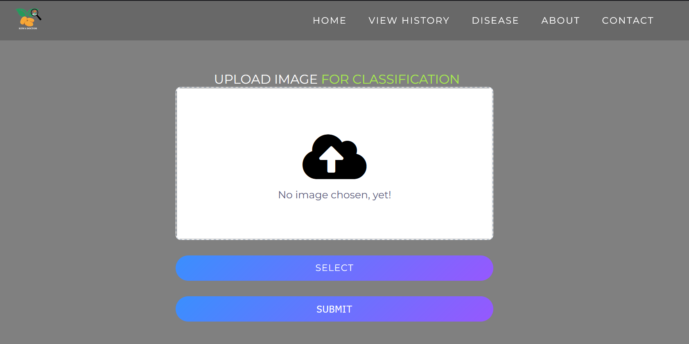

# KEWA DOCTOR : `Potato plant leaf disease identification`


https://user-images.githubusercontent.com/57824653/173225477-6d7ba20e-205d-465e-93e0-a75829721386.mp4


# Our Logo


# Problem statement

Plant diseases contribute to major yield losses. Every year, farmers face economic loss and crop failure due to various
diseases in potato plants. In developing countries such as Bhutan, plant diseases are detected
manually by trained professionals who monitor crop fields and examine potato foliage. This
task is extremely monotonous, in some cases it is inconvenient due to the absence of
professionals in remote regions. However, advances in image processing, and deep learning in
disease recognition of plant leaves using images can make the process much more efficient
and timely.

# About Project:

A project that was aimed to classify the disease of a potato leaf and  suggest the treatment for a leaf disease.This project is developed by a team of students at GCIT and the app uses Google’s Tensorflow machine learning tool. It was implemented using image classification and deep learning. The app allows you to capture the image of a leaf or upload from your device and classify. 

For more details please visit our website: [Website](https://kewadoctor.herokuapp.com)

We also created an API of our project and deployed it to [RapidAPI](https://rapidapi.com/Ugyenwangdi/api/kewa-doctor/)


## Architecture


## Machine Learning Workflow


## Model Deployment on android app


## Functionalities on mobile

- Camera feature to capture image.
- Choose image from phone gallery.
- Descriptions of most common potato leaf diseases and treatments.
- Use the image input to predict whether the image is healthy or infected by particular disease.
- Recommends treatment accordingly.
- About the project.


## Web features
- Choose image from phone gallery.
- Classify the disease of a potato leaf.
- It will suggests the treatment for a leaf disease.  
- Descriptions of most common potato leaf diseases and treatments.
- It will store your most recent predicted history for reference.
- Link to KEWA DOCTOR API.

## Installation of project 

To install `KEWA DOCTOR` project on your system:


```bash
$ git clone https://github.com/Ugyenwangdi/PotatoLeafDiseaseWeb.git
$ python -m venv env 
$ env\Scripts\activate
$ cd PotatoLeafDiseaseWeb
$ pip install -r requirements.txt
$ pip install protobuf
$ python manage.py runserver
```

# Home Page
  


Team 12:
- Galey Wangmo (12190051)
- Gyeltshen Wangdi (12190053)
- Tshering Dorji (12190093)
- Ugyen Wangdi (12190105)
